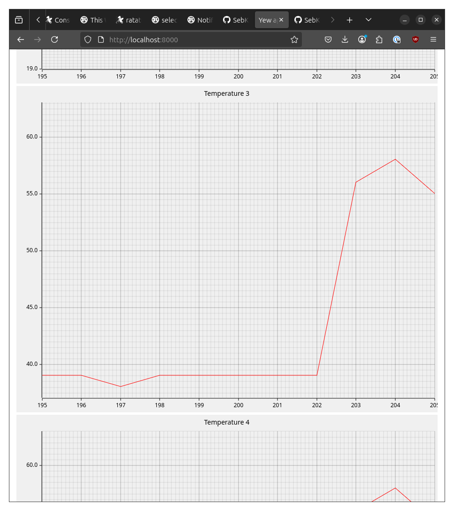

A small project to play with web technologies in Rust.

This project builds a small wasm web app using [yew](https://yew.rs/)
and [plotters](https://plotters-rs.github.io/home/#!/).  The web app
runs in a browser and gets temperature information over websockets from
a small server running on the network.

# Build

Build the host-side programs (server and client) in the host-side
directory with `cargo build`.  Start the server.

Build the web app using one of these commands:

* `trunk serve`: Build the web app and start a temporary web server to
    serve it up.  The trunk process will also watch the source tree for
    changes and recompile and restart any running web apps, convenient
    during development.  Install/update trunk with `cargo install trunk`.

* `trunk build --public-url http://example.com/path/to/app`: Just build
    it, then you have to manually copy the `dist/` directory to the
    matching place in the web server's filesystem.

Then point a web browser at the trunk url.
